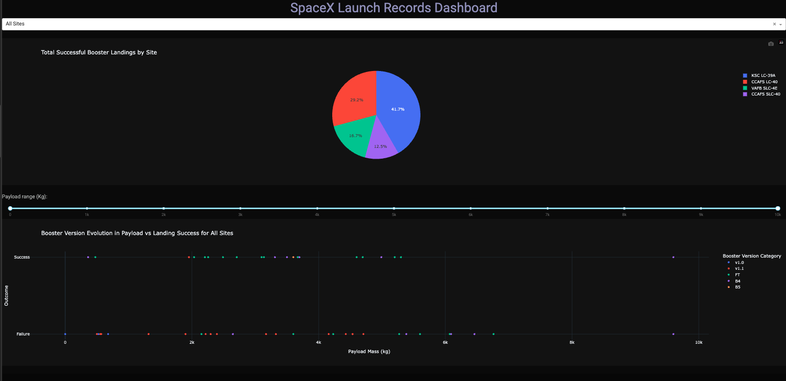
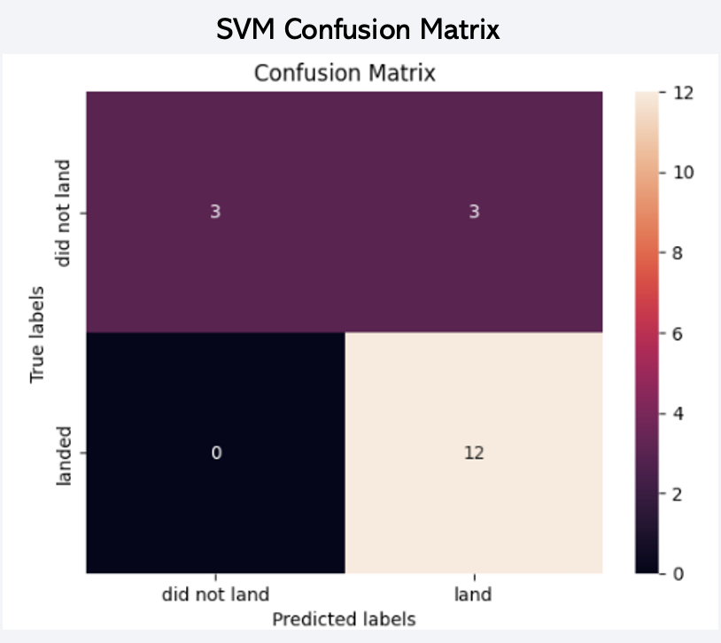

# 🚀 SpaceX Falcon 9 First-Stage Landing Prediction

## 📌 Project Overview  
This project analyzes SpaceX Falcon 9 launch data to predict the success of first-stage booster landings.  
The goal was to apply **data science and machine learning techniques** to explore how factors such as payload mass, launch site, and booster version influence landing outcomes, a critical factor in reducing launch costs through rocket reusability.  

By leveraging **Python, SQL, and machine learning models**, this project demonstrates end-to-end data analytics: from exploratory data analysis and interactive dashboards to predictive modeling.

---

## 🎯 Objectives
- Understand trends in Falcon 9 launches and landings.  
- Visualize how booster version, payload, and launch site affect landing outcomes.  
- Build predictive models to classify landing success/failure.  
- Identify the most important features driving landing success.  

---

## 📊 Exploratory Data Analysis (EDA)
- Analyzed **payload mass, orbit type, and launch site** distributions.  
- Identified **booster version** as the strongest predictor of landing success.  
- Built interactive dashboards (using **Plotly Dash**) to explore trends by site, payload, and outcomes.  
- Highlight: Landing success rates improved significantly with the introduction of **Block 5 boosters**.  

---

## 🖥️ Interactive Dashboard
An interactive dashboard was developed with **Plotly Dash** to visualize:  
- Launch success by payload mass and orbit.  
- Landing outcomes across different launch sites.  
- Booster version performance and reusability.
- [Web Application](Python/spacex-dash-app.py)
- [Video Demo](https://www.loom.com/share/f94396f62a7840cfa27423108a299303)
  

---

## 🤖 Machine Learning & Predictive Analysis
- Built multiple classification models:
  - **Logistic Regression**  
  - **Decision Tree**  
  - **Support Vector Machine (SVM)**
  - **K-Nearest Neighbors (KNN)**  
- Compared model performance using **ROC-AUC, accuracy, precision, recall, and F1-score**.  
- **Best Model**: SVM, chosen for its strong ROC-AUC and flexibility in threshold tuning to balance false positives and false negatives.  

📌 *Key Finding*:  
> Booster version emerged as the most critical predictor of landing success, followed by payload mass and launch site.  

---

## 🛠️ Tools & Technologies
- **Languages**: Python, SQL  
- **Libraries**: Pandas, NumPy, Matplotlib, Seaborn, Plotly, Dash, Scikit-learn  
- **Database**: MySQL  
- **Environment**: Jupyter Notebook

---

## 📸 Visuals
|  |   |
|-----------------------------------|-----------------------------------|
| **Average SpaceX Landing Success Rate per Year**  | **SpaceX Launch & Landing Infrastructure in the U.S.** <br> East and West Coast Hubs with NASA's Johnson Space Center in Houston |

|  |   |
|-----------------------------------|-----------------------------------|
| **Total NASA Payload Mass** <br> Mission that include NASA payloads account for ~17% of the<br>  payload mass SpaceX sends to orbit.|  **Average Payload Mass by Booster Version** <br> Each iteration of Falcon 9 significantly increased payload capacity | 

|  |   |
|-----------------------------------|-----------------------------------|
| **SVM - Best Model**  <br> ROC-AUC is the strongest ~96%. <br> False Postive rates can be reduced without sacrificing recall  | **The SVM Never Misses a successful landing(Recall = 100%).** <br> **It struggles with false positive. <br> 50% of the time, it predicts a landing when there was none.** |

---

## 🙌 Acknowledgements
- Cousera
- SpaceX Launch Data
- IBM Data Science Capstone Project (inspiration for dataset structure)
- Open-source Python community

---

## 👤 Author
- Olamide Olayinka
- 💼 [LinkedIn](https://www.linkedin.com/in/olamide-olayinka-a8222518/)


---

## 📂 Project Structure
```bash
├── data/                 # Raw and processed datasets
├── notebooks/            # Jupyter notebooks for EDA and modeling
├── dashboard/            # Dash app files
├── presentation/         # Charts, visuals, and results
├── README.md             # Project documentation

🚀 Results
Booster version is the primary driver of landing success.
Payload mass has a nonlinear relationship with success — heavier payloads reduce landing probability.
Launch site also plays a role, with some sites showing higher success rates.
The SVM model provided the best predictive performance.
📌 Practical Impact: These insights align with SpaceX’s real-world improvements in reusability and cost reduction.

🌟 Key Learnings
Real-world data requires extensive cleaning and transformation.
Interactive dashboards enhance data storytelling.
Model evaluation beyond accuracy (ROC-AUC, F1-score) is critical for imbalanced datasets.
Domain knowledge (rocket design, booster versions) matters when interpreting ML results.

